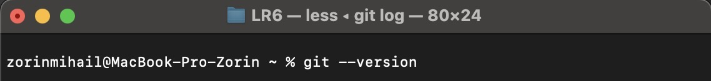
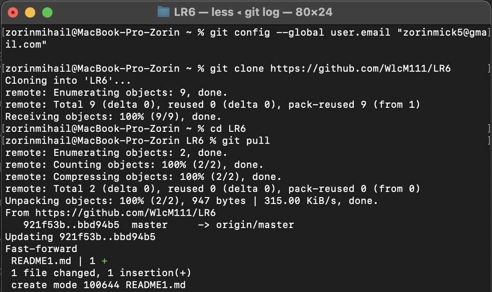
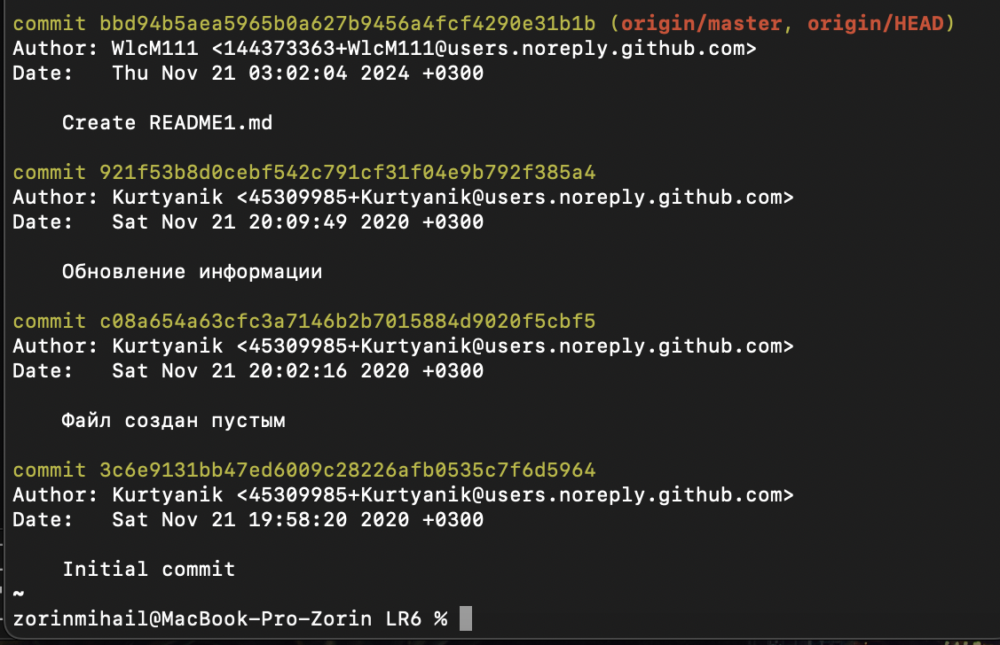
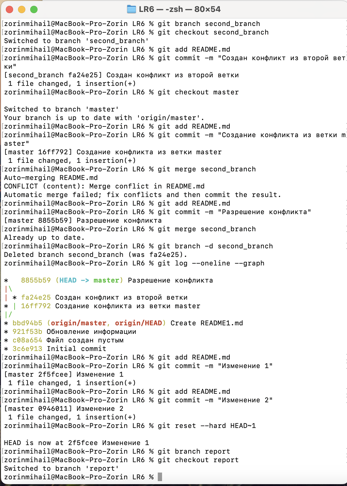
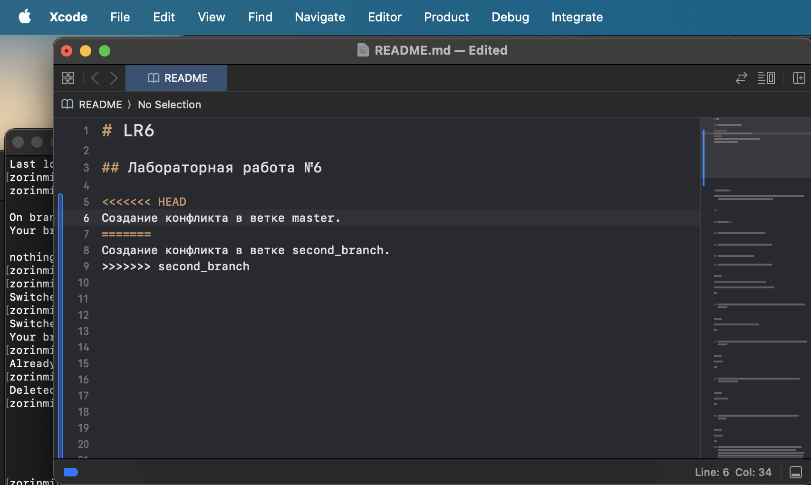

# LR6

## Лабораторная работа №6

  

**Цель работы:**

Изучение базовых возможностей системы управления версиями, опыт работы с Git Api опыт работы с локальным и удаленным репозиторием.

  

---

  

## Ход работы: ##

  

### 1. Аккаунт на GitHub уже был создан ранее.

  

### 2. Была сделана копия в личное хранилище (Fork).

  

### 3. Git уже был ранее установлен.

  
### 4. Git был настроен при помощи следующих команд:

  

```bash

git config --global user.name "4316 Zorin M.N."

git config --global user.email "zorinmick5@gmail.com"

```

  

### 5. Клонирование репозитория репозитория на локальный пк был вополнен следующей командой:

  

```bash

git clone https://github.com/Wlcm111/LR6

```

  

### 6. Через интерфейс GitHub был добавлен файл README1.md и далее подтягиваем файл с GitHub:

  

```bash

git pull

```

  

### 7. Чтобы просмотреть историю команд для каждой из веток надо использовать следующую команду:

  

```bash

git log --all

```


### 8. Далее были выведены последние изменения (коммита) с помощью следующей команды:

  

```bash

git show

```

### 9. Следом была создана ветка second_brancn, заьтем из нее был изменен файл README.md, далее он был добавлен в индекс и закоммичен, далее следует переключение на ветку master, в которой файл README.md меняется еще раз в том же самом месте и затем добавляется в инлдекс и коммитится. После при слиянии веток выбрасывается ошибка. Чтобы ее решить, надо вручную редактировать файл README.md исправляя конфликтные места и затем добавляется в индекс и коммититься. При повторном слиянии ошибок уже не возникает.

  

# Список команд:

  

Для создания ветки:

  

```bash

git branch second_branch

```

Для перехода в нее:


```bash

git checkout second_branch

```

  

Для добавления в индекс и коммита:

  

```bash

git add README.md

git commit -m "текст описание"

```

  

Для слияния веток выполняем команду из ветки master:

  

```bash

git merge second_merge

```

  

### 10. Чтобы удалить побочную ветку:

  

```bash

git branch -d second_branch

```

  

### 11. Делаем изменения несколько раз и коммитим их, затем делаем откат коммита при помощи следующей команды:

  

```bash

git reset --hard HEAD~1

```

  

### 12. Далее создаем ветку report для отчета ис начинаем офрмлять отчет в файле README.md используя программу XCode для MacOS. Соблюдаем синтаксис markdown. При написании отчета периодически коммитим изменения. Файлы скриншотов располагаются в отдельной папке screenshots.

  

### 13. Ниже представлены скриншоты терминала с выполнением всех команд:

1. Скриншот №1:





2. Скриншот №2:





3. Скриншот №3:


4. Скриншот №4:
  




5. Скриншот №5:





6. Скриншот №6 Конфликтные маркеры, показывающие проблемное место:



### 14. Лог всех команд:


Команда для вывод логов для Linux/MacOS:


```bash

history

```


1.  939  git branch second _branch
2.  940  git checkout second_branch
3.  941  git add README.md
4.  942  git commit -m "Создан конфликт из второй ветки"
5.  943  git checkout master
6.  944  git add README.md
7.  945  git commit -m "Создание конфликта из ветки master"
8.  946  git merge second_branch
9.  947  git add README.md
10.  948  git commit -m "Разрешение конфликта"
11.  949  git merge second_branch
12.  950  git branch -d second_branch
13.  951  git 10g --oneline --graph
14.  952  git add README.md
15.  953  git commit -m "Изменение 1"
16.  954  git add README.md
17.  955  git commit -m "Изменение 2"
18.  956  git reset --hard HEAD~1\n
19.  957  git branch report
20.  958  git checkout report
21.  959  git add .
22.  960  git index
23.  961  git status
24.  962  git add .
25.  963  git status
26.  964  git commit -m "Первый этап создания отчета"
27.  965  git add .
28.  966  git commit -m "Второй этап создания отчета"
29.  967  git add .
30.  968  git commit -m "Второй этап создания отчета"
31.  969  git add .
32.  970  git commit -m "Третий этап создания отчета"


### 15. Получаем историю в форматированном:

Команда для вывода форматированной истории:


```bash

git log --pretty=format:"%h | %ad | %an | %s" --date=short

```


**Результат:**

1. dfc88bf | 2024-11-23 | 4316 Zorin.M.N | Третий этап создания отчета
2. c8423f4 | 2024-11-23 | 4316 Zorin.M.N | Второй этап создания отчета
3. d672f3b | 2024-11-23 | 4316 Zorin.M.N | Первый этап создания отчета
4. 2f5fcee | 2024-11-22 | 4316 Zorin.M.N | Изменение 1
5. 8855b59 | 2024-11-22 | 4316 Zorin.M.N | Разрешение конфликта
6. 16ff792 | 2024-11-22 | 4316 Zorin.M.N | Создание конфликта из ветки master
7. fa24e25 | 2024-11-22 | 4316 Zorin.M.N | Создан конфликт из второй ветки
8. bbd94b5 | 2024-11-21 | WlcM111 | Create README1.md
9. 921f53b | 2020-11-21 | Kurtyanik | Обновление информации
10. c08a654 | 2020-11-21 | Kurtyanik | Файл создан пустым
11. 3c6e913 | 2020-11-21 | Kurtyanik | Initial commit


## Выводы: 

В ходе лабораторной работы были изучены основные методы работы с Git. Также был освоен фомат Markdown. Также был получен навык разрешения конфликтов при слиянии веток.