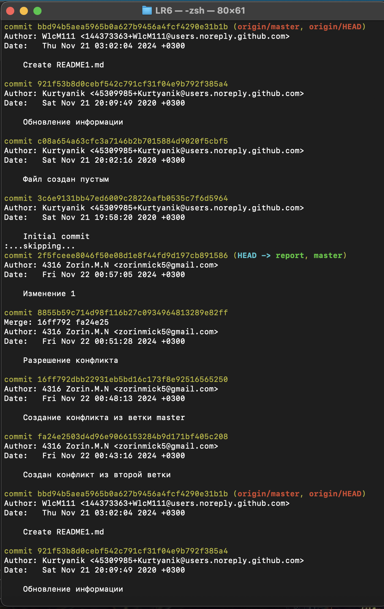

# LR6

## Лабораторная работа №6

  

**Цель работы:**

Изучение базовых возможностей системы управления версиями, опыт работы с Git Api опыт работы с локальным и удаленным репозиторием.

  

---

  

## Ход работы: ##

  

### 1. Аккаунт на GitHub уже был создан ранее.

  

### 2. Была сделана копия в личное хранилище (Fork).

  

### 3. Git уже был ранее установлен.

  
### 4. Git был настроен при помощи следующих команд:

  

```bash

git config --global user.name "4316 Zorin M.N."

git config --global user.email "zorinmick5@gmail.com"

```

  

### 5. Клонирование репозитория репозитория на локальный пк был вополнен следующей командой:

  

```bash

git clone https://github.com/Wlcm111/LR6

```

  

### 6. Через интерфейс GitHub был добавлен файл README1.md и далее подтягиваем файл с GitHub:

  

```bash

git pull

```

  

### 7. Чтобы просмотреть историю команд для каждой из веток надо использовать следующую команду:

  

```bash

git log --all

```


### 8. Далее были выведены последние изменения (коммита) с помощью следующей команды:

  

```bash

git show

```

### 9. Следом была создана ветка second_brancn, заьтем из нее был изменен файл README.md, далее он был добавлен в индекс и закоммичен, далее следует переключение на ветку master, в которой файл README.md меняется еще раз в том же самом месте и затем добавляется в инлдекс и коммитится. После при слиянии веток выбрасывается ошибка. Чтобы ее решить, надо вручную редактировать файл README.md исправляя конфликтные места и затем добавляется в индекс и коммититься. При повторном слиянии ошибок уже не возникает.

  

Список команд:

  

Для создания ветки:

  

```bash

git branch second_branch

```

Для перехода в нее:

  

```bash

git checkout second_branch

```

  

Для добавления в индекс и коммита:

  

```bash

git add README.md

git commit -m "текст описание"

```

  

Для слияния веток выполняем команду из ветки master:

  

```bash

git merge second_merge

```

  

### 10. Чтобы удалить побочную ветку:

  

```bash

git branch -d second_branch

```

  

### 11. Делаем изменения несколько раз и коммитим их, затем делаем откат коммита при помощи следующей команды:

  

```bash

git reset --hard HEAD~1

```

  

### 12. Далее создаем ветку report для отчета ис начинаем офрмлять отчет в файле README.md используя программу XCode для MacOS. Соблюдаем синтаксис markdown. При написании отчета периодически коммитим изменения. Файлы скриншотов располагаются в отдельной папке screenshots.

  

### 13. Ниже представлены скриншоты терминала с выполнением всех команд:

1. Скриншот №1:


2. Скриншот №2:


3. Скриншот №3:



4. Скриншот №4:
  


5. Скриншот №5:


### 14. Лог всех команд: